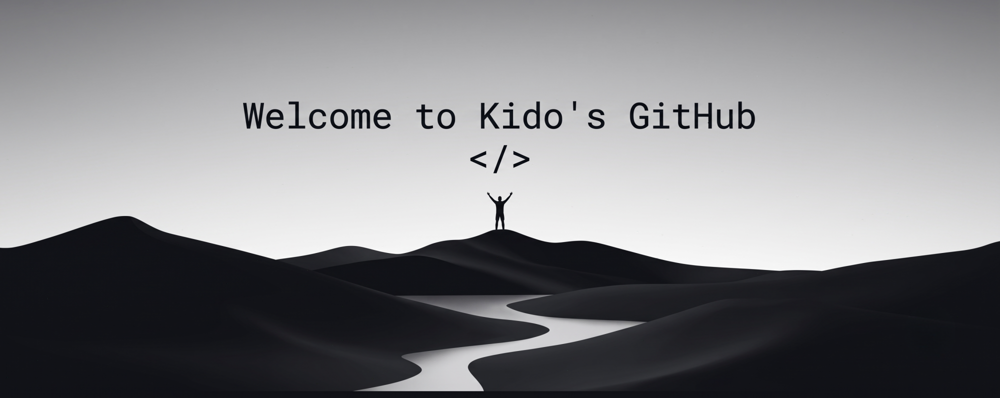

<!-- =========================================================
     KIDO-141 — GITHUB PROFILE
========================================================= -->

<div align="center">



<br><br>


<br>


</div>

<br>

<!-- =========================================================
     COMMAND DECK
========================================================= -->

<table width="100%">
<tr>

<td width="62%" valign="top">

## `~/about`

```text
┌─[ KIDO-141 ]─────────────────────────────────────────┐
│                                                     │
│  > whoami                                           │
│                                                     │
│  Developer focused on AI, software and              │
│  intelligent systems.                                │
│                                                     │
│  I like taking an idea, breaking it down,           │
│  building the system and making it actually work.   │
│                                                     │
│  > status                                            │
│                                                     │
│  [●] Learning                                       │
│  [●] Building                                       │
│  [●] Experimenting                                  │
│  [●] Improving                                      │
│                                                     │
└─────────────────────────────────────────────────────┘