<div align="center">



</div>

---

## <span style="color:#ff2020;">01 / ABOUT ME</span>

```bash
┌──[ KIDO-141@github ]
└─$ whoami

I am a developer who enjoys building useful,
creative, and reliable software.

Currently learning, experimenting,
and turning ideas into projects.
```

<div align="center">

| 🔴 | CURRENTLY |
|:---:|:---|
| `01` | Focused on building meaningful projects |
| `02` | Always learning new technologies |
| `03` | Interested in software, design, and automation |
| `04` | Open to collaboration and new ideas |

</div>

<br>

<p align="center">

</p>

---

## <span style="color:#ff2020;">02 / TECH STACK</span>

<div align="center">

### `LANGUAGES`


<br><br>

### `TOOLS`


<br><br>


</div>

---

## <span style="color:#ff2020;">03 / FEATURED PROJECTS</span>

```text
╔══════════════════════════════════════════════════════════════╗
║                     PROJECT TERMINAL                        ║
╠══════════════════════════════════════════════════════════════╣
║                                                              ║
║  [01]  PROJECT ONE                                           ║
║        └─ A project that solves a real problem               ║
║                                                              ║
║  [02]  PROJECT TWO                                           ║
║        └─ An experiment with modern technology               ║
║                                                              ║
║  [03]  PROJECT THREE                                         ║
║        └─ A creative project currently in development        ║
║                                                              ║
╚══════════════════════════════════════════════════════════════╝
```

> Replace these examples with your actual repositories.

<br>

<div align="center">


</div>

---

## <span style="color:#ff2020;">04 / GITHUB ACTIVITY</span>

<div align="center">


</div>

<br>

<div align="center">


</div>

---

<!-- =========================
     RED RUNNING LINE
========================= -->

<div align="center">


<br>


</div>

---

## <span style="color:#ff2020;">05 / CONNECT</span>

<div align="center">

```text
┌──────────────────────────────────────────┐
│                                          │
│             FIND ME ON GITHUB            │
│                                          │
└──────────────────────────────────────────┘
```

<a href="https://github.com/Kido-141">


</a>

</div>

---

<div align="center">

<br>


<br><br>


</div>
